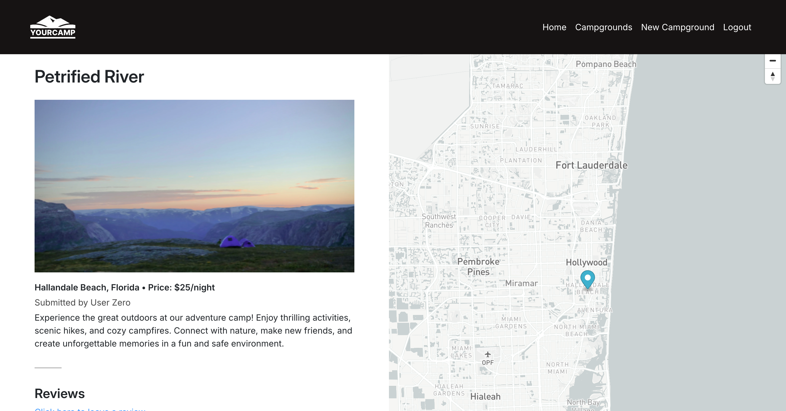
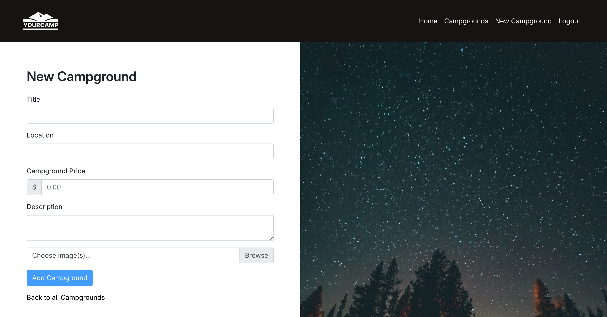
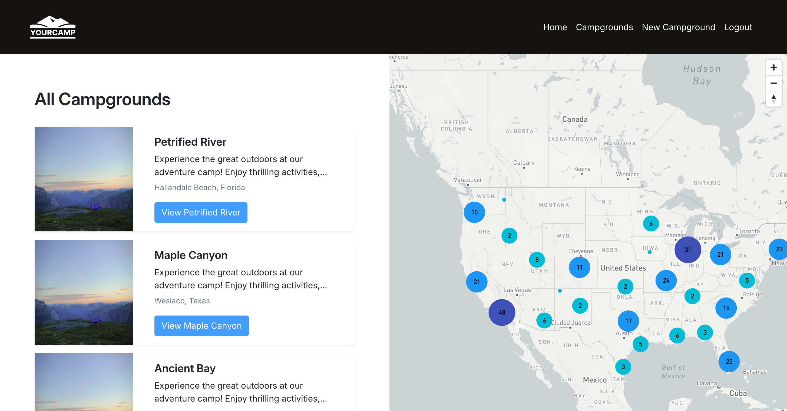
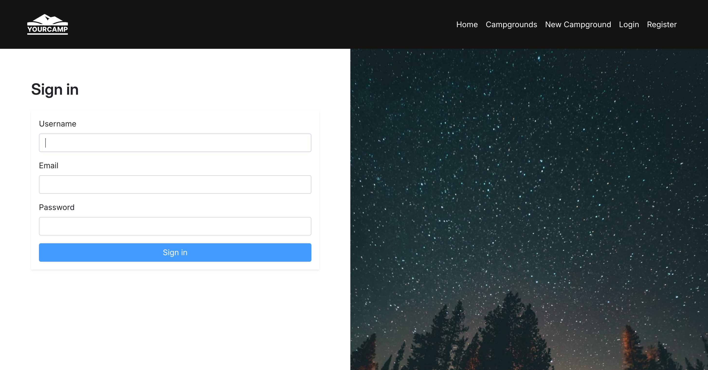

# 🚀 Project: YourCamp

## 📝 About

This web application allows users to **explore, review, and manage campgrounds**. It features **user authentication, image uploads via Cloudinary, and interactive maps**. Built using **Node.js, Express, MongoDB, and Cloudinary**, this app provides a seamless experience for campers looking to find and share the best spots.

## 🔗 Live Demo

[🌐 View Live App](https://yourcamp.onrender.com/)

## ⚡ Tech Stack

- **Backend:** Node.js, Express
- **Database:** MongoDB, Mongoose
- **Authentication:** Passport.js
- **Image Uploads:** Cloudinary
- **Frontend:** EJS, JavaScript, CSS
- **Error Handling:** Custom Express Middleware

## 📂 Project Structure

```
📦 Project Root
 ├── cloudinary/         # Cloudinary setup for image uploads
 │   ├── index.js
 │
 ├── controllers/        # Route controllers for handling logic
 │   ├── campgrounds.js
 │   ├── reviews.js
 │   ├── users.js
 │
 ├── models/             # Mongoose models for database schema
 │   ├── campground.js
 │   ├── review.js
 │   ├── user.js
 │
 ├── public/             # Static assets (CSS, JavaScript, images)
 │   ├── javascripts/
 │   ├── stylesheets/
 │   ├── bk-image.png
 │   ├── login-bk-new.jpeg
 │   ├── login-bk.png
 │   ├── logo-svg-v3.svg
 │   ├── logo.svg
 │
 ├── routes/             # Express route handlers
 │   ├── campgrounds.js
 │   ├── reviews.js
 │   ├── users.js
 │
 ├── seeds/              # Seed scripts for database initialization
 │   ├── cities.js
 │   ├── index.js
 │   ├── seedHelpers.js
 │
 ├── utils/              # Utility functions
 │   ├── ExpressError.js
 │   ├── catchAsync.js
 │
 ├── views/              # EJS templates for frontend rendering
 │
 ├── .gitignore          # Ignored files
 ├── app.js              # Main application entry point
 ├── middleware.js       # Custom middleware
 ├── package-lock.json   # Dependency lock file
 ├── package.json        # Dependencies and scripts
 ├── schemas.js          # Validation schemas
```

## 🛠️ Setup & Installation

```
git clone https://github.com/yourusername/campground-review-app.git
cd campground-review-app
npm install
npm run start
```

### Load the Application:

1. Start MongoDB (`mongod` or use Atlas for cloud storage).
2. Run `node seeds/index.js` to populate the database.
3. Start the server: `npm run start`.
4. Open `http://localhost:3000/` in your browser.

## 🎨 Customization

- Modify campground logic in `/controllers/campgrounds.js`
- Update database schema in `/models/campground.js`
- Adjust routes in `/routes/campgrounds.js`

## 📸 Screenshots

### 🔹 Home Page


### 🔹 Campground Details



### 🔹 Create Campground



### 🔹 All Campgrounds



### 🔹 Register



## 🤝 Connect with Me

- **LinkedIn:** [linkedin.com/in/ivan-via/](https://www.linkedin.com/in/ivan-via/)
- **GitHub:** [github.com/ivanvia7](https://github.com/ivanvia7)
- **Email:** [ivanvia.work@gmail.com](mailto:ivanvia.work@gmail.com)
